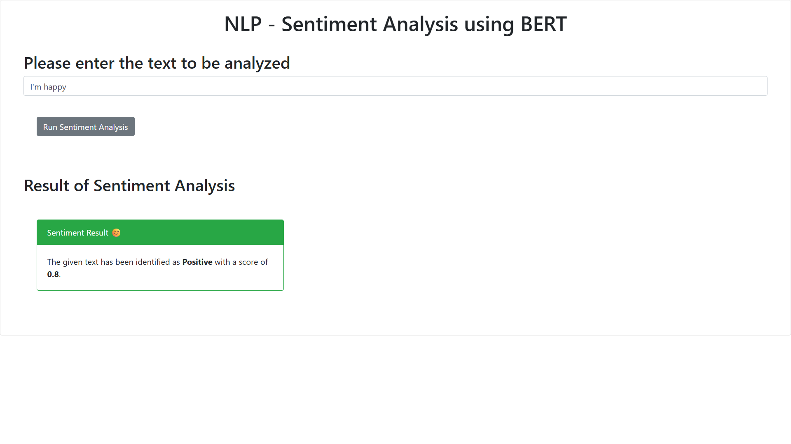

# 🧠 NLP - Sentiment Analysis using BERT (Flask + Local Model)

This is a simple yet powerful **Sentiment Analysis Web App** built using **BERT (Bidirectional Encoder Representations from Transformers)** and served through a **Flask** backend. The model runs locally (via TextBlob for now) and analyzes user-entered text to determine whether the sentiment is **Positive**, **Negative**, or **Neutral**.

---

## 🚀 Demo

> “I’m happy” → ✅ Identified as **Positive** with a score of **0.80**



---

## 🧰 Tech Stack

| Layer        | Tech/Tool                        |
|--------------|----------------------------------|
| Frontend     | HTML, CSS, Bootstrap             |
| Backend      | Python, Flask                    |
| NLP Model    | TextBlob (local sentiment)       |
| Deployment   | Localhost (Flask Server)         |

---

## 🗂️ Project Structure

```
sentiment-analyzer/
│
├── app.py                         # Flask main app
├── templates/
│   └── index.html                 # Frontend HTML file
├── SentimentAnalysis/
│   └── sentiment_analysis.py      # Local sentiment logic
├── static/
│   └── mywebscript.js             # Frontend JS
├── demo.png                       # Screenshot (used in README)
├── requirements.txt               # Python dependencies
└── README.md                      # This file
```

## ⚙️ How to Run Locally

1. 📦 **Install Dependencies**

````
   pip install -r requirements.txt
   python -m textblob.download_corpora
````

Your `requirements.txt` should include:

```
flask
textblob
```

2. 🏃‍♂️ **Start the Flask Server**
```
python app.py
```

   Then open your browser at:
   🔗 `http://127.0.0.1:5000/`

---

## 🧪 Example Sentences to Try

* “I love this project!”
* “This is the worst experience ever.”
* “It was okay, not too bad.”

---

## 🧠 How it Works

1. User enters a sentence in the web form.
2. Browser sends the sentence to Flask via a GET request.
3. Flask calls `analyze_local_sentiment()` in `sentiment_analysis.py`.
4. TextBlob computes polarity and returns a **label** (Positive/Neutral/Negative) and **score**.
5. Result is displayed in a styled Bootstrap card.

---

## 💡 Possible Improvements

* Replace TextBlob with a fine-tuned BERT model from HuggingFace.
* Add colored emojis and animated result cards.
* Persist analysis history in a database (SQLite/PostgreSQL).
* Deploy to Heroku / Render / Railway / HuggingFace Spaces.
* Add unit tests and a CI/CD pipeline.

---

## 📸 UI Preview

*Insert your UI screenshot here (e.g., `demo.png`)*

---

## 🙋‍♂️ Made by

**Yaswanth** — 1st Gen Engineer | AI/ML Aspirant | Python Developer
📍 Madurai, Tamil Nadu
🎓 Thiagarajar College of Engineering


---

## 📌 License

This project is licensed under the [MIT License](LICENSE).

